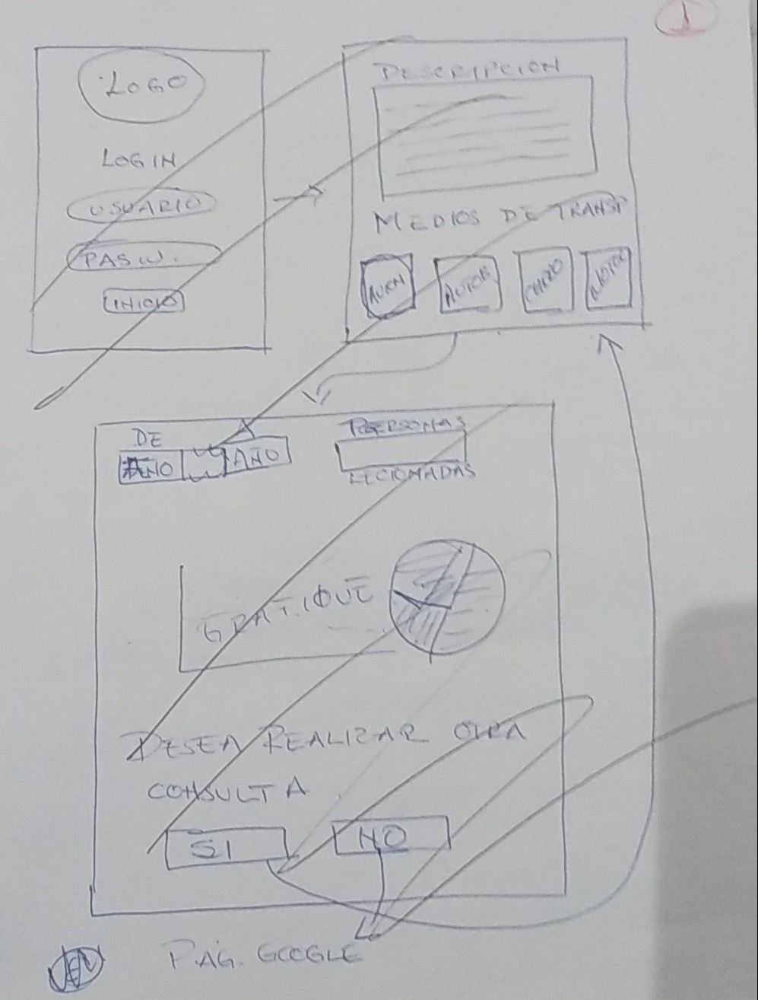
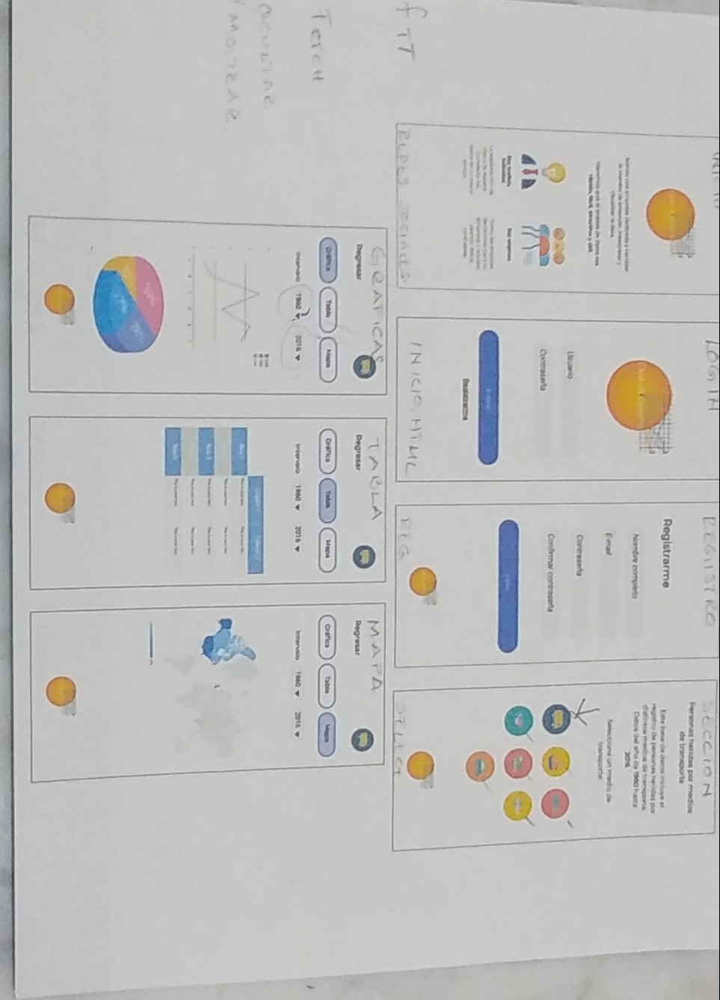

# Data Lovers

* [Personas heridas por medio de transporte en EEUU](src/data/injuries/injuries.json).
  Este set nos muestra el número de personas heridas en accidentes de
  transporte, con data anual desde 1960 y categorizada por tipo de transporte
  (aire, barco, automóvil, moto, bicicleta, ...).

### Definición del producto ### Historias de usuario

Historia 1: Yo como usuario quiero conocer la probabilidad de sufrir un accidente en 'x' medio de transporte para saber si conseguir un seguro de vida.

Historia 2: Yo como aseguradora quiero conocer el medio de transporte que tiene la tasa de accidentes más alta para cotizar el precio del seguro del medio de transsporte y el precio de seguro de vida de un usuario.

#### Prototipo de baja fidelidad

#### Prototipo de alta fidelidad

#### Imagen Final

