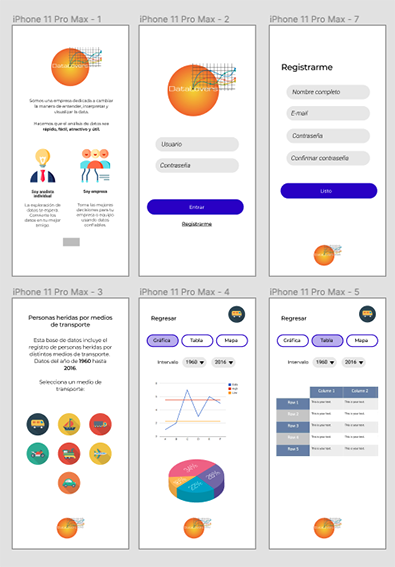

## PROYECTO
### ***Data Lovers***

***Aplicación Responsive***

Aplicación para el manejo y filtrado de datos,  de personas heridas por medio de transporte en EEUU, con data anual desde 1960 y categorizada por tipo de transporte (aire, barco, automóvil, moto, bicicleta, ...).

La aplicación mostrara como resultado de la solicitud, la data representada en una Gráfica de Pie 3D y una lineal, así como la tabla correspondiente a los datos.

## Usuarios

- Yo como usuario quiero conocer la probabilidad de sufrir un accidente en 'x' medio de transporte para saber si conseguir un seguro de vida.

- Yo como aseguradora quiero conocer el medio de transporte que tiene la tasa de accidentes más alta para cotizar el precio del seguro del medio de transsporte y el precio de seguro de vida de un usuario.

## PROTOTIPO DE BAJA FIDELIDAD

## PROTOTIPO DE ALTA FIDELIDAD

## IMAGEN FINAL DEL PROYECTO:

## TECNOLOGIA UTILIZADA:

- HTML5
- CSS3
- Javascript
- Google Charts

